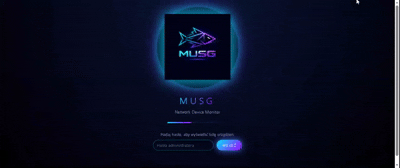

# MUSG Network Dashboard

MUSG is a local web dashboard for monitoring devices in your home network.  
It scans your LAN, shows all active devices as modern cards, and helps you react quickly when something new or suspicious appears.



> Note: MUSG is designed for monitoring **your own** network as an administrator.  
> Use it responsibly and in accordance with your local law.

---

## Features

- **Live device discovery**
  - Periodic ARP scan of your LAN subnet (e.g. `192.168.1.0/24`).
  - Device cards with IP, hostname, MAC address and vendor name (via MAC OUI lookup).
  - New devices are visually highlighted for the first few minutes.

- **Online / offline status**
  - Devices stay visible for up to one hour after they disappear from the network.
  - Status indicator changes from **Online** (green) to **Offline** (red) instead of instantly removing the card.

- **Close Network (whitelist mode)**
  - When enabled, MUSG takes a snapshot of currently active IPs and treats them as a whitelist.
  - Any new IP outside the whitelist is automatically marked as a potential intruder and deauthenticated from Wi‑Fi (within your own network).

- **Manual disconnect & intruder marking**
  - Context menu on each device:
    - View device details (IP, MAC, vendor, connection type, first seen time).
    - Set connection type (LAN / Wi‑Fi / Unknown).
    - Rename device card (local UI name).
    - “Disconnect and mark as intruder”.
  - Intruder devices are highlighted with a strong orange glow.
  - After disconnect is triggered, MUSG opens the router admin panel in a new browser tab and shows a small help window with step‑by‑step instructions (PL/EN) on how to block that client at the router level.

- **LAN vs Wi‑Fi**
  - Each device has a connection type badge:
    - `LAN` – wired,
    - `Wi‑Fi` – wireless,
    - `LAN/Wi‑Fi` – unknown.
  - Type can be set manually per IP and is stored in `conn_types.json`.

- **Security splash screen**
  - Initial splash asks for an admin password before showing any devices.
  - The same password is used for actions such as Close Network, disconnecting devices or changing settings.

- **Masked / hidden data**
  - Toggle to obfuscate IP addresses and hostnames with neon‑style random characters.
  - Useful when sharing your screen but you still want to see network activity.

- **Logs & settings**
  - Device events are appended to `logs.jsonl` (first seen, auto‑disconnect, manual disconnect, password changes, Close Network on/off, connection type changes).
  - Settings panel:
    - change admin password,
    - switch UI language (Polish / English),
    - view device logs.

---

## Tech Stack

- **Backend**
  - Python 3
  - Flask (HTTP API and HTML templates)
  - Scapy (ARP scan, Wi‑Fi deauth frames)
  - mac-vendor-lookup (MAC OUI → vendor name)

- **Frontend**
  - Pure HTML/CSS/JS (no framework)
  - Single‑page dashboard layout
  - Animated neon design, cards grid, context menus and modals
  - Bilingual UI (PL/EN) managed via a small JS i18n dictionary

---

## Requirements

- Linux machine (tested on RockPi / Rock64, Debian/Ubuntu‑like systems)
- Python 3.9+
- Root privileges (required by Scapy and monitor‑mode Wi‑Fi)
- External Wi‑Fi adapter that supports monitor mode (e.g. TL‑WN722N)
- Router in the same subnet (default: `192.168.1.0/24`)

---

## Installation

```bash
# clone repository
git clone https://github.com/<your‑user>/musg-network-dashboard.git
cd musg-network-dashboard

# (optional) create virtual environment
python3 -m venv venv
source venv/bin/activate

# install dependencies
pip install -r requirements.txt
